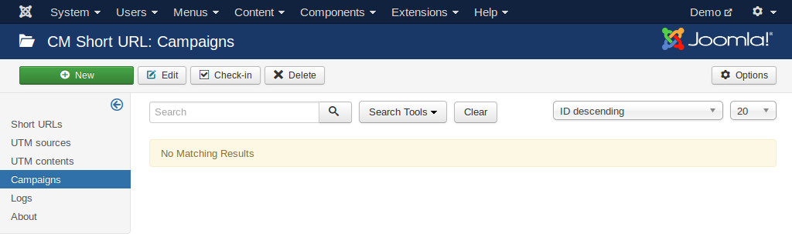
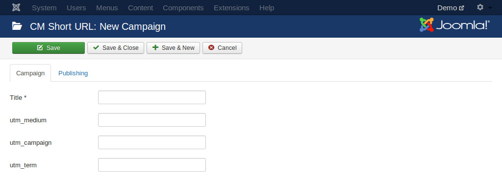

=========================
Google Analytics campaign
=========================

"Campaigns" in CM Short URL is where you manage and create sets of utm_medium, utm_campaign and utm_term of Google Analytics campagins.

Go to Extensions -> CM Short URL -> click "Campaigns" on the left submenu. "Campaigns" menu item is only visible to you if you enable "Enable UTM parameters" option in the component configuration.

Click "New" button on the toolbar to create a new campaign.

A campaign must have a title, this title is only for internal use, it is not added to original or shortened URLs.

The Google Analytics parameters utm_medium, utm_campaign and utm_term are optional, if they are provided they are appended to original URL before shortening.