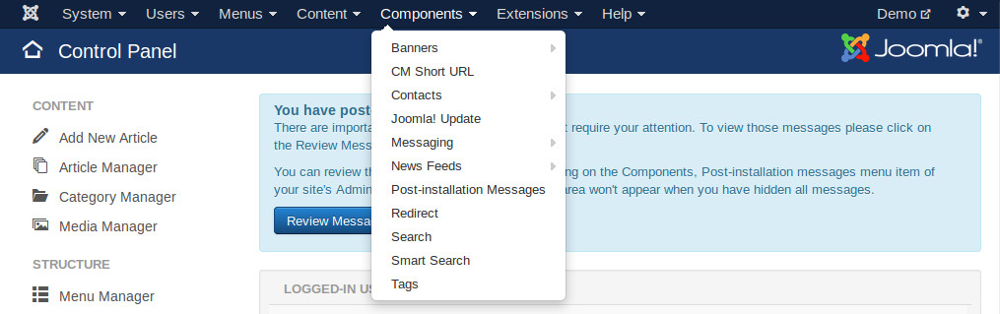
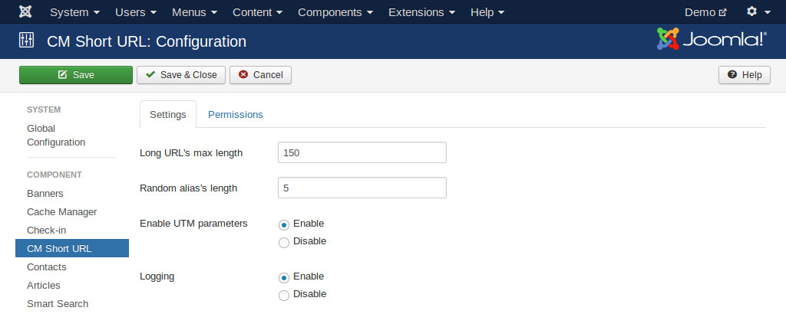
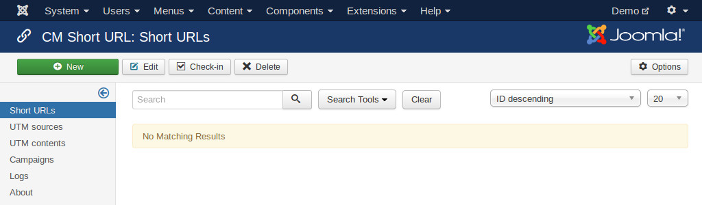

=============
Configuration
=============

In your Joomla!'s back-end, you go to Extensions -> CM Short URL to access CM Short URL.

The default page of CM Short URL is the list of shortened URLs.

.. image:: ../images/cmshorturl_empty_url_list.jpg

On the toolbar there is an "Options" button, you click this button to configure the component.

There are 4 configuration options:

* **Long URL's max length**: The maximum length of long URLs displayed in URL list. The long URLs which are longer this limit are truncated. This prevents URLs from breaking the page if they are too long. Default value is 150.
* **Random alias's length**: The length of random alias. Default value is 5. If you enter your own alias, there is no limit.
* **Enable UTM parameters**: Enable UTM parameters if you want to inlucde Google Analytics campaign parameters to your URLs. The options and info of UTM parameters will be hidden if you disable.
* **Logging**: Enable logging visitor's IP address, browser info and referral website if the info is available.

When you enable UTM parameters, "UTM sources", "UTM contents" and "Campaigns" are added to the component's submenu. "Log" menu item is also added to the submenu if you enable logging.

