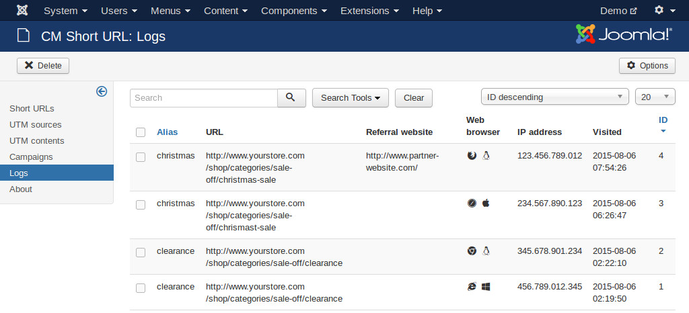

====
Logs
====

In Joomla! back-end, navigate to Extensions -> CM Short URL -> click "Logs" in the left submenu to access the logs of visitors. "Logs" menu item is not visible if you don't enable "Logging" option in the component configuration.

The logged information is based on the information in the request from visitor. It is calculated the same as Hits value in URL list (using session).

Referral webiste is where visitor clicks short URL. If this information is not available then visitor may directly access short URL or the information is not included in the request. This information is not always correct because technical visitors can set this information before sending the request to your site.

Web browser column includes 2 icons for web browser and operating system. You can hover your mouse pointer over the icons to see the names of web browser/operating system. This information is not always correct because technical visitors can set this information before sending the request to your site and some unpopular browsers are not recognized.

IP address field contains the IP address from which visitor accesses short URL.

If your site is big and has many visitors coming to your site from short URLs, enabling logging may increase the size of your database because the number logged accesses is so big, so you may consider to disable logging.