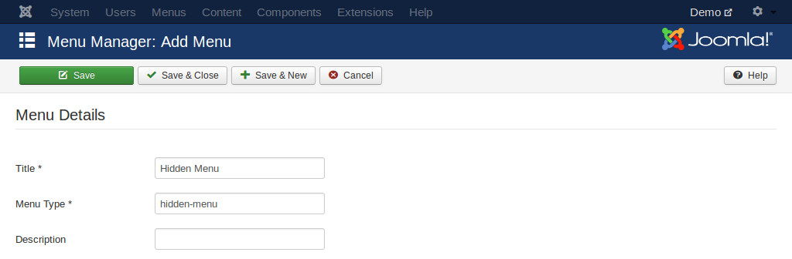
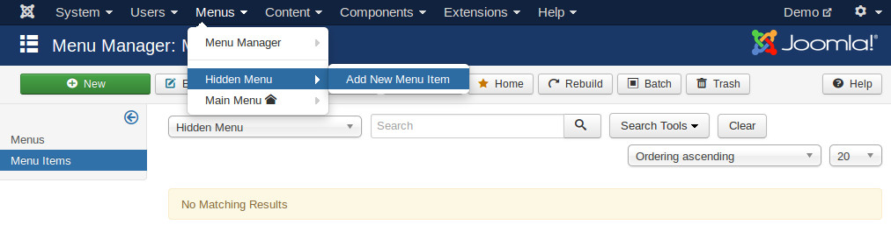
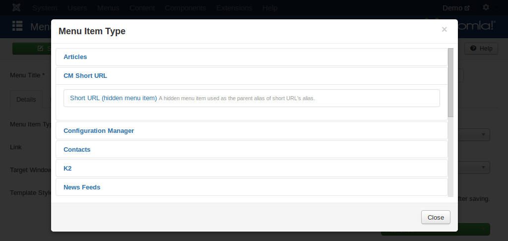
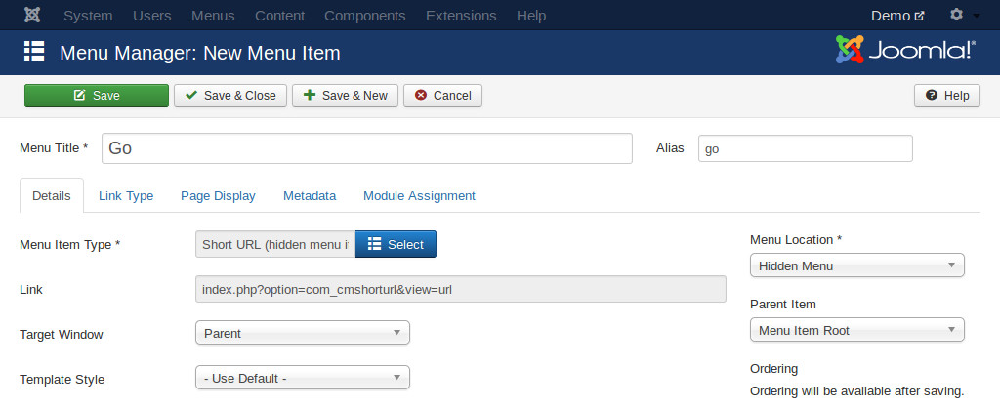

=========
Menu item
=========

There is only 1 front-end menu item for CM Short URL, it is called "Short URL". This menu item is used as the parent menu item of shortened URLs to prevent conflicts with other menu items and other components on the site.

This "Short URL" menu item needs to be used a hidden menu item. Hidden menu or hidden menu item are not visible in your front-end.

If you don't have any hidden menu yet, you can create a new one by navigating to Menus -> Menu Manager -> Add New Menu.

You can name the new menu's title and menu type whatever you want, in the above screenshot the menu is called "Hidden Menu" with menu type "hidden-menu".

To create a new menu item in this menu, you go to Menus -> Hidden Menu -> Add New Menu Item or go to Menus -> Hidden Menu -> click New button on the toolbar.

In the form, you click "Select" button of "Menu Item Type" field, in the modal window you select "Short URL (hidden menu item)" in "CM Short URL" section.

Give the menu item a title, you can choose whatever title, however you should provide a short value for "Alias" option, this alias value decides what your short URLs look like. For example of your alias is "go" like in the screenshot below, then the shortened URLs could look like this: http://www.yoursite.com/go/my-web-page

"go" alias is inspired by NASA's shortening URL system - http://go.nasa.gov.