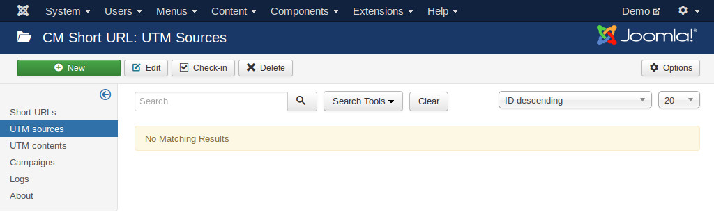

=======================
Google Analytics source
=======================

You need to enable "Enable UTM parameters" option in the component configuration to use this feature.

In Joomla! back-end, navigate to Extensions -> CM Short URL -> click "UTM sources" on the left submenu.

Click "New" button on the toolbar to create a new utm_source.

.. image:: ../images/cmshorturl_source_form.jpg

The title is for internal use, it is not added to original or shortened URLs. utm_source field's value is appended to original URL before shortening.